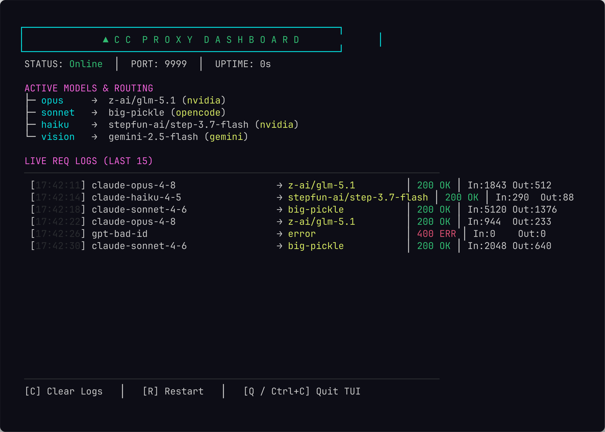

# acc

[](https://github.com/ATruePerson/acc/actions/workflows/ci.yml)
[](https://pkg.go.dev/github.com/ATruePerson/acc)
[](LICENSE)

Anthropic API → OpenAI-compatible proxy. Routes Claude SDK calls to
third-party providers (NVIDIA NIM, Gemini, OpenRouter, OpenCode, ZAI) by
translating message format, tool use, streaming, and images between protocols.

Point Claude Code (or any Anthropic-SDK client) at acc, and your requests get
re-routed to cheaper or alternative models without the client knowing the
difference.

## Dashboard

Run with `-tui` for a live terminal dashboard showing active routes and
per-request logs:



## Quick Start (no toolchain needed)

```bash
# 1. Install (downloads a prebuilt binary to ~/.local/bin)
curl -fsSL https://raw.githubusercontent.com/ATruePerson/acc/main/scripts/install.sh | sh

# 2. Set up — pick providers, paste keys, writes config for you
acc setup

# 3. Launch Claude Code through acc
acc claude

# Or launch Codex Desktop through acc
acc codex
```

That's it. `acc setup` asks which providers you have keys for and writes
`~/.config/acc/.env` + `config.json`. `acc claude` starts the proxy and opens
Claude Code already pointed at it. `acc codex` safely backs up your Codex
subscription connection, switches Codex Desktop to ACC, and reopens it. Your
permissions, skills, plugins, and other Codex settings stay in place.

### Commands

| Command            | What it does                                          |
| ------------------ | ----------------------------------------------------- |
| `acc setup`        | First-time setup: pick providers, paste keys          |
| `acc doctor`       | Test that your keys actually work (✅ / ❌ per provider) |
| `acc models`       | List the model names you can use and where they route |
| `acc claude [...]` | Start the proxy and launch Claude Code through it      |
| `acc codex [path]` | Switch Codex Desktop to ACC and launch it              |
| `acc codex --restore` | Switch Codex Desktop back to your subscription    |
| `acc` / `acc -tui` | Run the proxy directly (`-tui` for the dashboard)      |

Codex defaults to Sol. The three Codex-only ACC aliases are:

| Codex model | ACC alias | Follows |
| --- | --- | --- |
| Codex 5.6 Sol | `openai/codex-5.6-sol` | `opus` route |
| Codex 5.6 Terra | `openai/codex-5.6-terra` | `sonnet` route |
| Codex 5.6 Luna | `openai/codex-5.6-luna` | `haiku` route |

Choose one at launch:

```bash
acc codex --model openai/codex-5.6-luna /path/to/project
```

Running `acc codex` in a terminal shows a Sol/Terra/Luna picker. Codex Desktop
currently hides locally supplied custom models from its own model picker, so the
app may label the selected ACC model as `Custom`; select it through `acc codex`
or `--model` instead. ACC opens the existing `/Applications/ChatGPT.app`
directly and never runs the bundled `codex app` installer.

### From source

```bash
go install github.com/ATruePerson/acc@latest   # or: go run . -config config.json
export ANTHROPIC_BASE_URL=http://localhost:9999 # if not using `acc claude`
```

The `-env` flag loads a dotenv file (default `~/.config/acc/.env`).
Variables are set only if not already in the environment.

## Configuration

### `config.json`

Routes map Claude model families to upstream providers:

| Slot    | Default route                          |
| ------- | -------------------------------------- |
| opus    | GLM-5.1 via NVIDIA NIM                 |
| sonnet  | big-pickle via OpenCode                |
| haiku   | DeepSeek V4 Flash via NVIDIA NIM       |
| vision  | Gemini 3.5 Flash (image requests)      |

Override per-request by using the direct path form as the model name:

```
<anything>/<provider>/<model...>
```

Example: `anthropic/nvidia/z-ai/glm-5.1` routes to NVIDIA using GLM-5.1 directly.

### Effort mapping

Thinking budget tokens → `reasoning_effort` bucket:

```json
"effort": {
  "low":       { "budget": 2000,  "reasoning": "low" },
  "medium":    { "budget": 6000,  "reasoning": "low" },
  "high":      { "budget": 16000, "reasoning": "medium" },
  "ultracode": { "budget": 48000, "reasoning": "high" }
}
```

### Providers

| Provider    | Base URL                                    |
|-------------|---------------------------------------------|
| NVIDIA NIM  | `https://integrate.api.nvidia.com/v1`       |
| Gemini      | `https://generativelanguage.googleapis.com/v1beta/openai` |
| OpenRouter  | `https://openrouter.ai/api/v1`              |
| ZAI         | `https://api.z.ai/api/paas/v4`              |
| OpenCode    | `https://opencode.ai/zen/v1`                |

API keys come from environment variables — never hardcode secrets in config.json.

## Features

- **Protocol translation** — Anthropic `/v1/messages` ↔ OpenAI `/v1/chat/completions`
- **Codex Desktop** — Responses API translation, model discovery, streaming, and tool round-trips
- **Streaming** — real-time SSE with per-token flushing
- **Tool use** — function calling in both directions
- **Images** — translates image blocks to OpenAI format
- **Effort mapping** — thinking budget → reasoning_effort
- **Graceful shutdown** — drains active requests on SIGINT/SIGTERM
- **Context cancellation** — cancels upstream if client disconnects
- **CORS** — cross-origin headers for desktop/UI tools
- **Config validation** — catches misspelled providers at startup, not first request

## Security

**Run on localhost only.** acc has no authentication. It binds to all
interfaces on the configured port, so exposing it to a network lets anyone
send requests through your upstream API keys.

Other things to keep in mind:

- **Protect your key file.** The default dotenv path is `~/.config/acc/.env`;
  restrict file permissions (`chmod 600`) so other users on the machine
  cannot read your provider keys.
- **No TLS.** Traffic between your client and acc is plaintext. That is
  fine for `localhost`, but do not terminate TLS here and expose the port.
- **Data leaves your machine.** Every prompt, tool call, and image is
  forwarded to whichever upstream provider your routing config selects.
- **Upstream errors are echoed.** Failed provider responses are logged and
  partially returned to the client, which can leak provider error details.
- **CORS is open.** `Access-Control-Allow-Origin: *` is intentional for
  local desktop tools, but it widens who can call the API if the port is
  reachable.

## Tests

```bash
go test -v ./...
```

## API

### `GET /health`

```
acc ok
```

### `GET /v1/models`

Lists advertised Claude model IDs so model discovery works.

### `POST /v1/messages`

Standard [Anthropic Messages API](https://docs.anthropic.com/en/api/messages)
format. Translated to OpenAI chat completions upstream and back.

### `POST /v1/responses`

OpenAI Responses format used by Codex. Translated to OpenAI-compatible chat
completions upstream and streamed back as Responses events.

## License

Apache License 2.0 — see [LICENSE](LICENSE).
